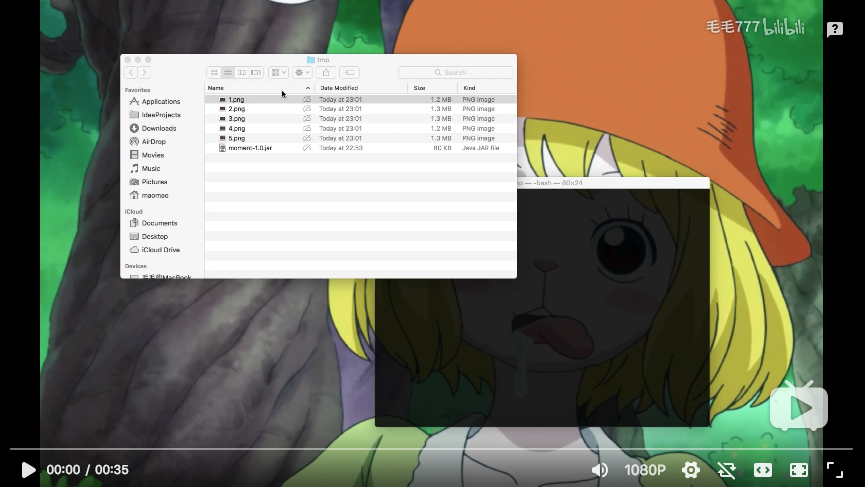

# Moment [](https://github.com/FantasticMao/moment/actions) [](https://github.com/FantasticMao/moment/releases) [](https://github.com/FantasticMao/moment/blob/master/LICENSE)

Moment 是一个简单（可能没用）的小工具，它可以把多张图片（一般是视频截图）的底部字幕，拼接到第一张图片底下。

## 在线演示
Moment 可以用来保存视频的精彩瞬间：

[](https://www.bilibili.com/video/av31172471)

## 下载和使用
Moment 下载地址：https://github.com/FantasticMao/moment/releases ，它以 Java 语言编写，以 .jar 文件发布，使用时需预先 [安装 Java 运行环境](https://www.baidu.com/s?wd=安装%20JRE)。

Moment 使用手册：
```
java -jar moment-1.0.jar [options]
  Options:
  * -p, --path
      The path of image list that need to be stitched
    -h, --height
      The bottom subtitle height should be in unit px
      Default: 120
    --out
      The directory to save the finished image
      Default: the current directory
```